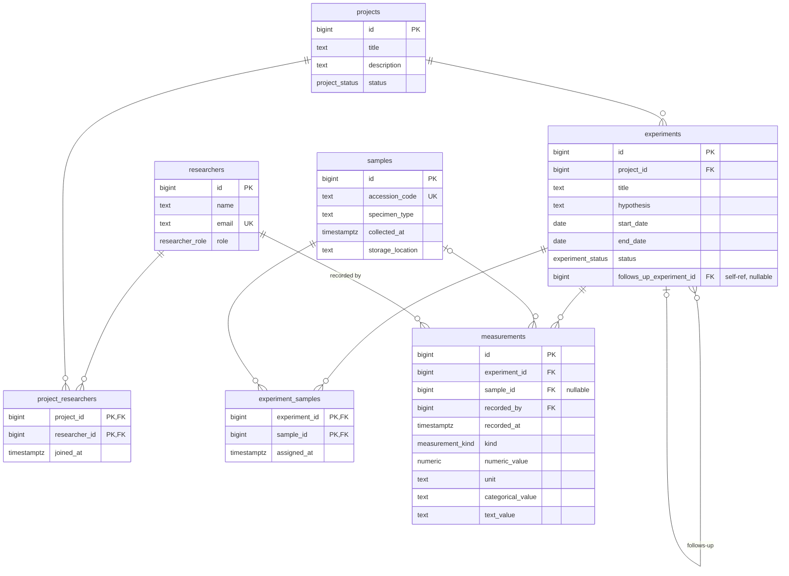

# Lab Experiment Tracking — Data Model

Take-home exercise. Designs the Postgres data model that will sit under a
laboratory experiment tracking system. The deliverable is the schema +
seed data + this README; see [`lab-experiment-tracking-system.md`](./lab-experiment-tracking-system.md)
for the full brief.

> **Status:** Schema complete. All four spec-required seed scenarios exercised
> end-to-end in [`tests/test_seed_scenarios.py`](./tests/test_seed_scenarios.py).
> 100% branch coverage maintained throughout.

## Quick start

```bash
make start
```

That's it. The command brings up Postgres on a dynamically assigned host
port, applies migrations, and runs seed. Confirm with:

```bash
make db-shell
\dt
```

`make start` also writes `.env` with the actual host port (`DATABASE_URL`
and `TEST_DATABASE_URL`); do not edit `.env` by hand — it is regenerated
every time `make up` runs.

## Prerequisites

- Docker + Docker Compose
- [`uv`](https://docs.astral.sh/uv/) (Python package manager)
- Python 3.11+ (resolved by `uv` from `.python-version`)

## Schema at a glance

7 tables (5 aggregates + 2 m:n joins), 4 Postgres enums. Full legend and
constraint notes in [`docs/schema.md`](./docs/schema.md).



Headline invariants visible above:

- All FKs are `ON DELETE RESTRICT` — labs archive, they don't delete.
- `measurements` is polymorphic via STI; a CHECK constraint
  (`measurement_value_matches_kind`) enforces that exactly one kind's
  value columns are populated per row. Load-bearing invariant of the design.
- `experiments.follows_up_experiment_id` is a self-FK for replication /
  iteration chains; a single-row CHECK prevents self-reference, but
  multi-row cycles (A→B→A) are a domain-service concern.

## What's here

```
.
├── docker-compose.yml         # postgres:16-alpine, dynamic host port
├── Makefile                   # `make help` lists everything
├── alembic/versions/          # 8 migrations
├── src/lab/
│   ├── config.py              # pydantic-settings (DATABASE_URL et al.)
│   ├── db.py                  # SQLAlchemy 2.x sync engine
│   ├── models/                # 7 aggregates
│   │   ├── researcher.py / project.py / sample.py
│   │   ├── experiment.py      # self-FK + 2 CHECK constraints
│   │   ├── measurement.py     # polymorphic STI + CHECK discriminator (D3)
│   │   └── project_researcher.py / experiment_sample.py  # m:n joins
│   └── seed.py                # idempotent; exercises all four spec scenarios
├── tests/                     # ~77 tests at 100% branch coverage
│   ├── test_<entity>.py       # per-aggregate schema/constraint tests
│   ├── test_seed.py           # seed contribution + idempotency
│   ├── test_seed_scenarios.py # end-to-end spec scenarios
│   └── test_queries.py        # representative read paths (interview ammo)
└── docs/
    ├── schema.md              # full ER diagram + constraint notes
    ├── superpowers/specs/     # design docs (infra + schema)
    ├── superpowers/plans/     # implementation plans
    └── future-enhancements.md # things deliberately not built
```

## Common commands

```bash
make help            # list every documented target
make up              # start postgres, write .env with dynamic port
make down            # stop postgres
make migrate         # alembic upgrade head against lab
make migration m="…" # autogenerate a new revision
make seed            # seed the lab database with demonstration data (idempotent)
make test            # pytest (100% branch coverage enforced)
make coverage        # pytest + open htmlcov/index.html
make lint            # ruff check
make format          # ruff format
make db-shell        # psql into lab
```

## Tests

```bash
make test           # 100% branch coverage enforced; fails otherwise
make coverage       # opens htmlcov/index.html
```

The coverage gate is enforced commit-by-commit via `pyproject.toml`
addopts (`--cov-branch --cov-fail-under=100`). A change that drops
coverage cannot land.

## Schema-level assumptions

1. Researcher `role` is global to the lab, not per-project (D2). If it's actually per-project, the role column moves from `researchers` to `project_researchers` in one migration.
2. Researchers don't leave a project before it completes — no `left_at` on `project_researchers` (D2 open question).
3. New measurement kinds are added rarely enough that a per-kind migration is acceptable (D3 — if reality is closer to "new kind every sprint," revisit toward JSONB).
4. `specimen_type` is free text — the spec's "blood, tissue, chemical compound, soil, and so on" suggests an open vocabulary, not an enum.
5. Samples have no consumption lifecycle in this design — spec is silent on whether they're consumed/depleted/disposed (D5 open question).
6. `storage_location` is opaque text — labs use varied schemes (barcode / hierarchical path / locker code), and structuring presumptively is wrong without seeing the actual scheme (D6).
7. No soft delete. Hard delete is blocked by FK `RESTRICT` where dependents exist. Lifecycle status enums (`project_status`, `experiment_status`) carry "not current" meaning via `completed`/`cancelled`.
8. Synthetic `bigserial` IDs everywhere. Samples additionally carry `accession_code` (the lab-owned identifier) as a separate UNIQUE column (D4).
9. Cross-table invariants (measurement timestamp ∈ experiment date range, no measurements after experiment completes) are NOT enforced at the DB level — Postgres CHECK can't span rows. These are domain-service concerns if/when they matter.

## Schema-level tradeoffs

1. **STI for measurements** (D3) — gain: invariants visible in `\d measurements` as a CHECK constraint, vanilla SQL queries trivial; cost: migration to add a new kind. Considered JSONB; chose STI because the spec's "occasionally" cadence accepts migrations and DB-enforced invariants matter for defensibility.
2. **RESTRICT-everywhere FK behavior** — gain: deliberate deletion (forces handling of dependents); cost: more work to actually delete anything (which is correct — labs archive, they don't delete).
3. **Single-text `storage_location`** — gain: accepts any scheme; cost: not directly queryable by sub-component.
4. **`bigserial` over UUID** — gain: simpler, faster, smaller; cost: not federation-ready (no federation needed here).
5. **Free-text `specimen_type`** — gain: accepts any specimen vocabulary; cost: typo risk and no enumeration of valid values.
6. **Separate `project_status` and `experiment_status` enums** (D7) — gain: distinct lifecycles reflect spec wording ("its own lifecycle status"); cost: two enum types where one could have sufficed.
7. **`updated_at` auto-refresh via SQLAlchemy ORM, not a Postgres trigger.** The `onupdate=func.now()` declaration fires when the ORM issues an UPDATE through a tracked session; raw SQL (`session.execute(update(...))`, direct `psql` updates, future bulk-update scripts) bypasses it. Production-correct answer: add a `BEFORE UPDATE` trigger on each table with `updated_at`. Deferred for this take-home because the seed never updates rows (idempotency is `ON CONFLICT DO NOTHING` / check-then-insert, not upsert).

## Open questions for the lab (schema-level)

1. Do researchers ever leave a project mid-flight? (Would need `left_at` on `project_researchers`.)
2. What's the actual cadence of new measurement kinds — quarterly? monthly? (Informs whether STI stays or we move to JSONB.)
3. Do samples have a consumption lifecycle (in-use → depleted → disposed)?
4. Is `storage_location` a free-form code or a hierarchical path we should structure?
5. Are there researchers who serve different roles on different projects?
6. Are measurements ever recorded by automated instruments without a human attributor? (Currently `recorded_by` is NOT NULL — assumes human attribution.)
7. Should `experiments.follows_up_experiment_id` chains prevent cycles (A→B→A)? The single-row CHECK prevents self-reference (`id = follows_up_experiment_id`) but multi-row cycles are a domain-service concern, not a DB invariant. Is cycle prevention a real requirement, or do follow-up chains always form trees in practice?

## Future enhancements

See [`docs/future-enhancements.md`](./docs/future-enhancements.md).

---

## Appendix — infra-level notes

The remaining sections describe the project's plumbing — useful context for
evaluating *how* the schema was built, but secondary to the data-model
deliverable above.

### Assumptions (infra-level)

- Python 3.11+ is acceptable (CI/host).
- Reviewers run `make start` once and don't need the test database
  pre-created — `make migrate-test` handles it lazily.
- Postgres 16 specifically. No effort spent on cross-version compatibility.
- Host port for Postgres is **not** fixed to 5432. Docker assigns an
  ephemeral host port to avoid collisions with other local Postgres
  instances; the Makefile writes `.env` with the actual port. Reviewers
  on a clean machine will see a different port on every `make up` and
  this is intentional.
- `tests/test_db.py` connects to the dev `lab` database (not `lab_test`).
  The query is a read-only `SELECT 1`, so this is harmless — but `make
  test` requires `make up` to have populated `.env` with a live host
  port. `make start` covers both. See Enhancement G in
  `docs/future-enhancements.md`.

### Tradeoffs (infra-level)

- **Two schema representations.** Models in `src/lab/models/` are
  source-of-truth for *changes*; generated Alembic migrations in
  `alembic/versions/` are source-of-truth for *what's deployed*.
  Reviewers should read the migrations as the deliverable; the models
  are the authoring tool.
- **Sync, not async.** No HTTP layer to demand async. Captured as
  Enhancement B in `docs/future-enhancements.md`.
- **100% branch coverage as a build gate.** The cost is that every
  conditional in `db.py`/`config.py`/`seed.py` must be covered. The
  benefit is design pressure — untested branches become a design
  problem to solve, not a TODO to defer.
- **No FastAPI / HTTP surface.** Considered and explicitly chose not to.
  The spec asks for a data model; adding an API would be vanity work
  here. Roughly an hour to add if needed — see Enhancement A.
- **`pg_isready` polyfill instead of `docker compose up -d --wait`.**
  The user's installed Docker Compose (2.15.1) doesn't support `--wait`.
  Polyfill is a temporary measure; see Enhancement D.

### Open questions (infra-level)

- Should CI gate down-migrations too, or accept "rollback is a runbook
  step" as the SLA?
- Should `make start` also run `make test` to give reviewers a one-shot
  "is everything healthy" signal, or is the current bootstrap-only
  semantics cleaner?
- Should `make coverage` depend on `migrate-test` for self-sufficiency,
  or is the current "run after `make test`" implicit ordering acceptable?
