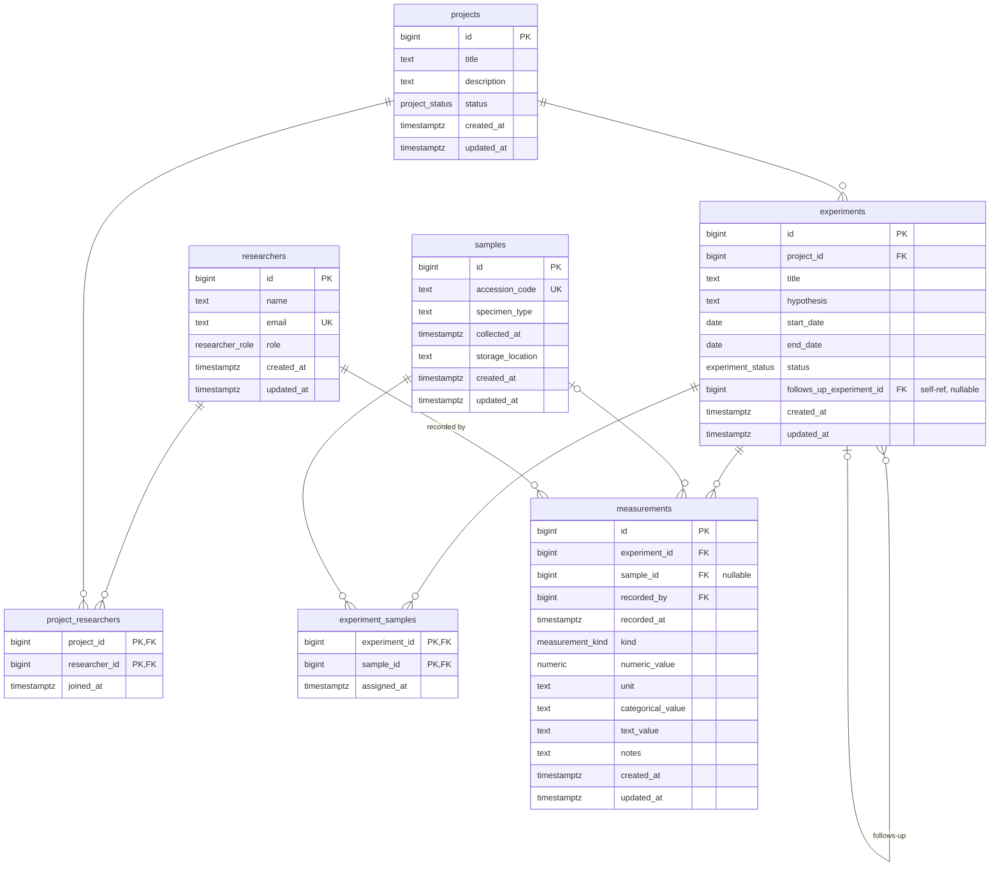

# Schema — Entity-Relationship Diagram

The data model has **7 tables** (5 aggregates + 2 m:n join tables) and **4 Postgres enums**. The deliverable is a defensible data model; everything below describes what's in `alembic/versions/` after `make start`.

## Legend

- **PK** — primary key
- **FK** — foreign key
- **UK** — UNIQUE constraint
- **PK,FK** — primary-key column that is also a foreign key (m:n join tables)
- Cardinality follows the Mermaid convention: `||--o{` reads as "exactly one ↔ zero or more"; `|o--o{` is "zero or one ↔ zero or more"; `}o--o|` is "zero or more ↔ zero or one" (used for self-FKs).

## Enums (Postgres `CREATE TYPE … AS ENUM`)

| Enum | Values |
|---|---|
| `researcher_role` | `principal_investigator`, `lab_technician`, `graduate_student`, `postdoc`, `undergraduate` |
| `project_status` | `planning`, `active`, `completed`, `cancelled` |
| `experiment_status` | `planned`, `running`, `completed`, `cancelled` |
| `measurement_kind` | `numeric`, `categorical`, `text` |

Project and experiment status are deliberately distinct enums with distinct vocabularies (D7 in the [schema design](./superpowers/specs/2026-05-12-schema-design.md)) — `planning`/`active` vs `planned`/`running` reinforces that these are separate lifecycles, even though some values coincide.

## Notable constraints

- **All FKs are `ON DELETE RESTRICT`** — no cascades anywhere. Labs archive, they don't delete; the schema makes that posture explicit.
- **`measurements.measurement_value_matches_kind` CHECK** is the polymorphic discriminator (D3) — the load-bearing invariant. It enforces three branches at the row level:
  - `kind = 'numeric'` ⇒ `numeric_value IS NOT NULL AND unit IS NOT NULL` and the other kind-specific columns are NULL
  - `kind = 'categorical'` ⇒ `categorical_value IS NOT NULL` and other columns NULL
  - `kind = 'text'` ⇒ `text_value IS NOT NULL` and other columns NULL
- **`experiments.experiment_date_order` CHECK** — `end_date >= start_date` when both are present; either may be NULL.
- **`experiments.experiment_no_self_follow_up` CHECK** — `follows_up_experiment_id <> id` (single-row prevention of self-reference). Multi-row cycles (A→B→A) are not enforced at the DB level; that's a domain-service concern.

## Why polymorphic STI for measurements?

Three options were considered:

| Approach | Adding a kind | DB-enforced "numeric has unit" | `SELECT avg(numeric_value) WHERE unit='mg/dL'` |
|---|---|---|---|
| **STI** (chosen) | Migration (`ALTER TYPE` + `ALTER TABLE` CHECK) | Yes (CHECK) | Trivial |
| JSONB value column | Data-only (no migration) | Awkward (JSONB CHECK) | `WHERE value->>'value' > '7.5'` (cast + slower) |
| Class-table inheritance | Migration (new table) | Yes (NOT NULL on child) | Joins required |

The spec says new measurement kinds appear "occasionally" — STI is acceptable at that cadence, and DB-enforced invariants matter for defensibility.

## Indexes

| Table | Index | Reason |
|---|---|---|
| `project_researchers` | `ix_project_researchers_researcher_id` | "Which projects is Alice on?" (composite PK only indexes leading-column lookups) |
| `experiments` | `ix_experiments_project_id` | "Experiments in this project" |
| `experiments` | `ix_experiments_follows_up_experiment_id` | "What follow-ups reference this experiment?" |
| `experiment_samples` | `ix_experiment_samples_sample_id` | "Experiments using this sample" |
| `measurements` | `ix_measurements_experiment_id_recorded_at` | Composite; supports both equality filters on `experiment_id` and ordered scans by `recorded_at` |
| `measurements` | `ix_measurements_sample_id` | "All measurements for this sample" |
| `measurements` | `ix_measurements_recorded_by` | "What did Bob record?" |
| `measurements` | `ix_measurements_kind` | "All numeric readings" |

## How this aligns with the spec deliverable

The four [spec-required seed scenarios](../lab-experiment-tracking-system.md) map directly onto the relationships above:

1. **Multi-researcher project** → `project_researchers` rows clustering on a single `project_id` (Glucose Tolerance Study has Alice + Bob + Carol).
2. **Experiment referencing earlier experiment** → `experiments.follows_up_experiment_id` (the OGTT replication references the baseline).
3. **Sample across multiple experiments** → `experiment_samples` rows clustering on a single `sample_id` (GTS-001 is used in baseline + follow-up).
4. **Measurements of multiple kinds** → `measurements` rows with at least two distinct `kind` values (2 numeric + 1 categorical + 1 text).

Each scenario is asserted end-to-end in [`tests/test_seed_scenarios.py`](../tests/test_seed_scenarios.py).
